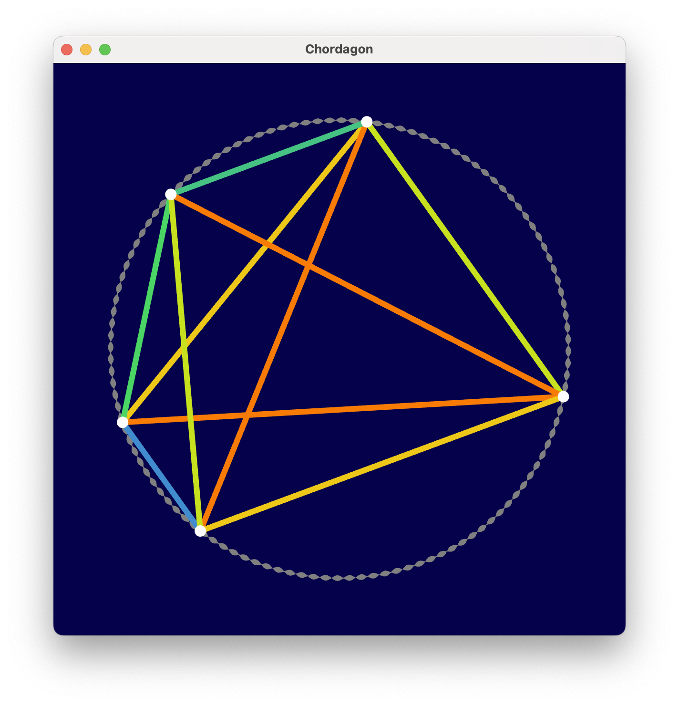

CHORDAGON
=========
A microtonal chord visualizer.



Chordagon receives notes from a midi controller and plots them on a pitch
circle. The frequency for each note is picked up with
[MTS-ESP](https://github.com/ODDSound/MTS-ESP).

Each pair of notes is connected by a line. Each line corresponds to an interval
in the chord being played. The lines are coloured based on the size of the
corresponding interval.

Build
-----
```console
$ git clone --recurse-submodules https://github.com/narenratan/chordagon
$ cd chordagon
$ cmake -B build
$ cmake --build build
```
